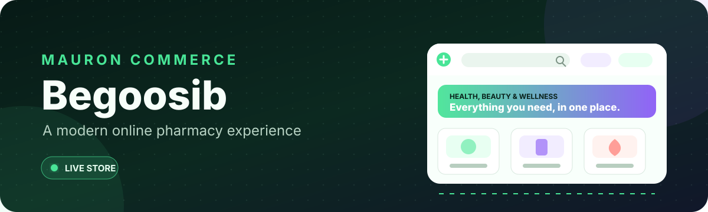

  

  
  
  

## Overview

**Begoosib** is a modern online-pharmacy experience focused on fast product discovery, clear health-commerce journeys, strong mobile usability, and a recognizable visual identity.

<a href="https://begoosib.com"><strong>Visit the live storefront &rarr;</strong></a>

## Experience highlights

- Responsive pharmacy storefront and product discovery
- Search, category, and brand-first navigation
- Commerce-focused promotional and installment-payment surfaces
- Mobile-first customer journeys and phone-based account experience
- Reusable UI system for products, campaigns, and health content
- Cloud-ready build and deployment workflow

## Technology

`Next.js 16` · `React 19` · `TypeScript 5` · `Tailwind CSS 4` · `Cloudflare` · `Vinext` · `Drizzle`

## Repository policy

> This repository is a public presentation layer only. Application source, commerce logic, integrations, customer data, credentials, deployment configuration, and private project documentation remain in a separate private repository.

Product design and engineering by <a href="https://github.com/mehdimauron">MAURON</a>.

